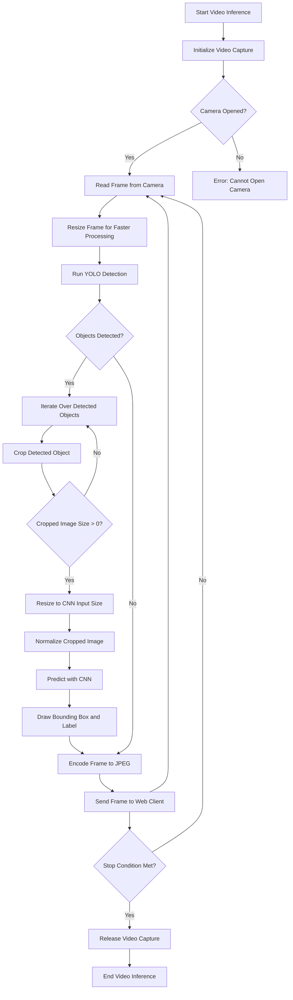

# Video Inference Flowchart

Below is a flowchart that outlines the video inference process using OpenCV and YOLO:

## Explanation

1. **Start Video Inference:** The process begins when the user initiates video inference.
2. **Initialize Video Capture:** OpenCV initializes the video capture object to access the camera.
3. **Camera Opened?:** Check if the camera is successfully opened.
    - **Yes:** Proceed to read frames from the camera.
    - **No:** Display an error message indicating that the camera cannot be opened.
4. **Read Frame from Camera:** Continuously read frames from the camera in a loop.
5. **Resize Frame for Faster Processing:** Resize the frame to a smaller size to reduce computational load and improve processing speed.
6. **Run YOLO Detection:** Apply the YOLO model to the resized frame to detect objects.
7. **Objects Detected?:** Check if any objects are detected by YOLO.
    - **Yes:** Iterate over the detected objects.
    - **No:** Encode the frame to JPEG format and send it to the web client.
8. **Iterate Over Detected Objects:** Loop through each detected object.
9. **Crop Detected Object:** Crop the detected object from the frame.
10. **Cropped Image Size > 0?:** Check if the cropped image size is greater than zero.
    - **Yes:** Proceed to resize the cropped image to the CNN input size.
    - **No:** Continue to the next detected object.
11. **Resize to CNN Input Size:** Resize the cropped image to the input size required by the CNN model.
12. **Normalize Cropped Image:** Normalize the pixel values of the cropped image.
13. **Predict with CNN:** Use the CNN model to predict the class of the cropped image.
14. **Draw Bounding Box and Label:** Draw a bounding box around the detected object and label it with the predicted class and confidence score.
15. **Encode Frame to JPEG:** Encode the processed frame to JPEG format.
16. **Send Frame to Web Client:** Send the encoded frame to the web client for display.
17. **Stop Condition Met?:** Check if the stop condition (e.g., user stops the inference) is met.
    - **No:** Continue reading frames from the camera.
    - **Yes:** Release the video capture object and end the video inference process.
18. **Release Video Capture:** Release the video capture object to free up resources.
19. **End Video Inference:** The video inference process ends.

---
Feel free to reach out if you have any questions or need further clarification on the video inference process.
